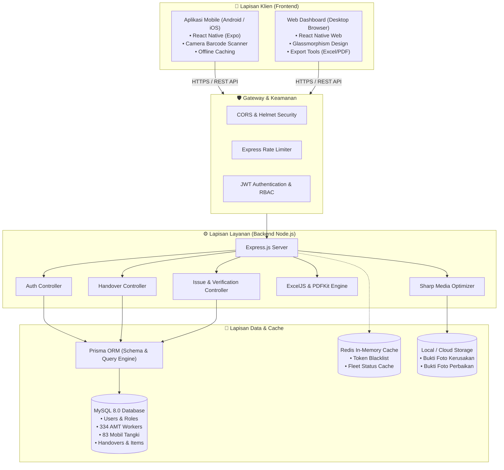
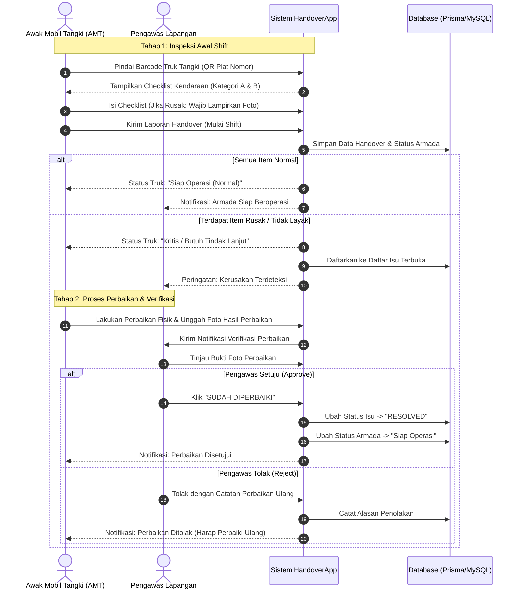
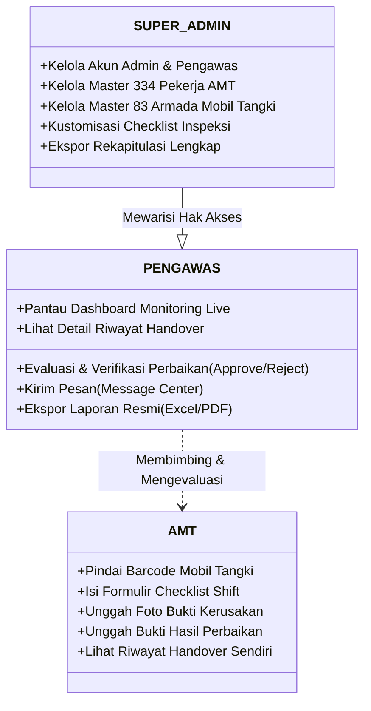

# 🏛️ Arsitektur Sistem HandoverApp Pertamina

Dokumen ini mendokumentasikan arsitektur teknis, diagram aliran data, dan siklus hidup operasional aplikasi **Pertamina HandoverApp**.

---

## 1. Diagram Arsitektur Tingkat Tinggi (High-Level Architecture)

---

## 2. Alur Serah Terima & Siklus Hidup Isu (Lifecycle State Machine)

---

## 3. Matriks Otorisasi Berbasis Peran (RBAC)

---

## 4. Keamanan & Kepatuhan Data

1. **Autentikasi Aman**: Menggunakan JSON Web Tokens (JWT) dengan masa berlaku dan algoritma hashing `bcrypt` (10 rounds salt).
2. **Proteksi Injeksi SQL**: Seluruh interaksi database menggunakan Prisma ORM dengan *parameterized queries* terkompilasi.
3. **Penyaringan Header HTTP**: Menerapkan modul `helmet` untuk menonaktifkan header berbahaya dan mencegah serangan XSS serta Clickjacking.
4. **Pembatasan Laju Request**: `express-rate-limit` mencegah serangan Brute-Force pada rute autentikasi sensitif.
